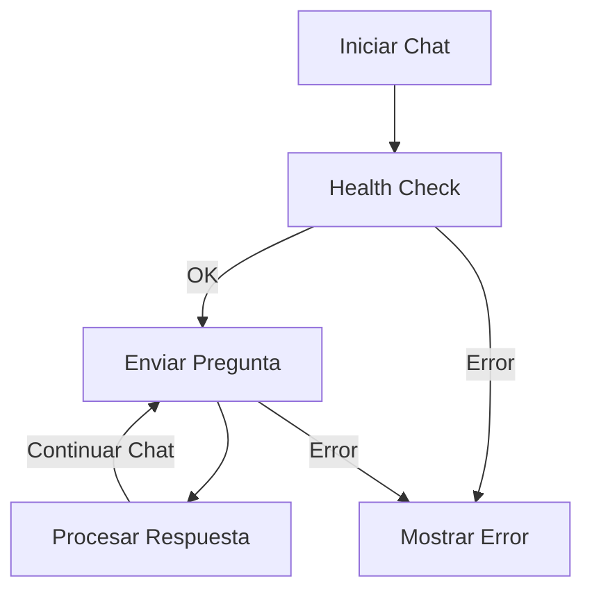

# 🎯 Guía de Integración Frontend - UDCito API

## 🔌 Endpoints y Uso

### Flujo de Conversación Recomendado



### 1. Verificación de Estado
```http
GET /health
```

**Uso:** Verificar disponibilidad del servicio antes de iniciar chat.

```javascript
// Ejemplo de verificación
async function checkHealth() {
  try {
    const response = await fetch('http://localhost:8000/health');
    const data = await response.json();
    
    if (data.overall_status !== 'healthy') {
      throw new Error('Servicio no disponible');
    }
    
    return true;
  } catch (error) {
    console.error('Error de conexión:', error);
    return false;
  }
}
```

### 2. Consulta Principal
```http
POST /consultar
Content-Type: application/json
```

**Request:**
```javascript
{
  "question": string,     // Pregunta actual
  "history": [           // Historial de conversación
    {
      "role": "user" | "assistant",
      "content": string
    }
  ]
}
```

**Response:**
```javascript
{
  "reply": string        // Respuesta del asistente
}
```

#### Ejemplo de Implementación:

```typescript
// Tipos
interface Message {
  role: 'user' | 'assistant';
  content: string;
}

interface ChatRequest {
  question: string;
  history: Message[];
}

interface ChatResponse {
  reply: string;
}

// Clase para manejo del chat
class UDCitoChat {
  private baseUrl: string;
  private history: Message[] = [];

  constructor(baseUrl = 'http://localhost:8000') {
    this.baseUrl = baseUrl;
  }

  async sendMessage(question: string): Promise<string> {
    try {
      const response = await fetch(`${this.baseUrl}/consultar`, {
        method: 'POST',
        headers: {
          'Content-Type': 'application/json',
        },
        body: JSON.stringify({
          question,
          history: this.history
        })
      });

      if (!response.ok) {
        throw new Error(`Error: ${response.status}`);
      }

      const data: ChatResponse = await response.json();
      
      // Actualizar historial
      this.history.push(
        { role: 'user', content: question },
        { role: 'assistant', content: data.reply }
      );

      return data.reply;

    } catch (error) {
      console.error('Error en consulta:', error);
      throw error;
    }
  }

  getHistory(): Message[] {
    return [...this.history];
  }

  clearHistory(): void {
    this.history = [];
  }
}
```

### Ejemplo de Uso en React

```tsx
import React, { useState, useEffect } from 'react';
import { UDCitoChat } from './services/chat';

interface Message {
  role: 'user' | 'assistant';
  content: string;
}

const Chat: React.FC = () => {
  const [messages, setMessages] = useState<Message[]>([]);
  const [input, setInput] = useState('');
  const [isLoading, setIsLoading] = useState(false);
  const [error, setError] = useState<string | null>(null);
  
  const chatService = new UDCitoChat();

  const handleSubmit = async (e: React.FormEvent) => {
    e.preventDefault();
    if (!input.trim()) return;

    setIsLoading(true);
    setError(null);

    try {
      const response = await chatService.sendMessage(input);
      
      setMessages(prev => [
        ...prev,
        { role: 'user', content: input },
        { role: 'assistant', content: response }
      ]);
      
      setInput('');
    } catch (err) {
      setError('Error al enviar mensaje. Por favor, intenta nuevamente.');
    } finally {
      setIsLoading(false);
    }
  };

  return (
    <div className="chat-container">
      {/* Mensajes */}
      <div className="messages">
        {messages.map((msg, index) => (
          <div key={index} className={`message ${msg.role}`}>
            {msg.content}
          </div>
        ))}
        {isLoading && <div className="loading">Escribiendo...</div>}
        {error && <div className="error">{error}</div>}
      </div>

      {/* Formulario */}
      <form onSubmit={handleSubmit}>
        <input
          type="text"
          value={input}
          onChange={(e) => setInput(e.target.value)}
          placeholder="Escribe tu pregunta..."
          disabled={isLoading}
        />
        <button type="submit" disabled={isLoading}>
          Enviar
        </button>
      </form>
    </div>
  );
};

export default Chat;
```

### Manejo de Errores

```typescript
// Tipos de error comunes
enum ChatErrorType {
  NETWORK = 'NETWORK_ERROR',
  SERVER = 'SERVER_ERROR',
  TIMEOUT = 'TIMEOUT_ERROR',
  VALIDATION = 'VALIDATION_ERROR'
}

class ChatError extends Error {
  constructor(
    public type: ChatErrorType,
    public message: string,
    public status?: number
  ) {
    super(message);
  }
}

// Manejo de errores
async function handleChatError(error: any): Promise<string> {
  if (error.status === 429) {
    return "Demasiadas solicitudes. Por favor, espera un momento.";
  }
  
  if (error.status === 500) {
    return "Error interno del servidor. Contacta a soporte.";
  }
  
  if (error.name === 'AbortError') {
    return "La solicitud tomó demasiado tiempo. Intenta nuevamente.";
  }
  
  return "Error de conexión. Verifica tu internet.";
}
```

### Buenas Prácticas

1. **Gestión del Estado**
   ```typescript
   // Usar estados para tracking
   const [chatState, setChatState] = useState<'idle' | 'typing' | 'error'>('idle');
   ```

2. **Feedback Visual**
   ```typescript
   // Mostrar indicadores de estado
   {chatState === 'typing' && <TypingIndicator />}
   {chatState === 'error' && <ErrorMessage />}
   ```

3. **Rate Limiting**
   ```typescript
   // Implementar throttling
   const throttledSend = throttle(sendMessage, 1000);
   ```

4. **Persistencia**
   ```typescript
   // Guardar historial en localStorage
   const saveHistory = (messages: Message[]) => {
     localStorage.setItem('chat_history', JSON.stringify(messages));
   };
   ```

### Consideraciones de UI/UX

1. **Estados de Carga**
   - Mostrar "typing" mientras se genera respuesta
   - Deshabilitar input durante carga
   - Indicador de scroll para mensajes nuevos

2. **Errores**
   - Mensajes de error amigables
   - Opción de reintentar
   - Mantener historial en caso de error

3. **Accesibilidad**
   - Usar ARIA labels
   - Soporte para teclado
   - Contraste adecuado

4. **Responsividad**
   - Adaptable a móviles
   - Manejo de pantalla táctil
   - Layout flexible

### Ejemplo de Estilos (CSS)

```css
.chat-container {
  max-width: 800px;
  margin: 0 auto;
  padding: 20px;
}

.messages {
  height: 500px;
  overflow-y: auto;
  padding: 20px;
  border: 1px solid #ddd;
  border-radius: 8px;
}

.message {
  margin: 10px 0;
  padding: 10px;
  border-radius: 8px;
}

.message.user {
  background-color: #e3f2fd;
  margin-left: 20%;
}

.message.assistant {
  background-color: #f5f5f5;
  margin-right: 20%;
}

.loading {
  color: #666;
  font-style: italic;
}

.error {
  color: #d32f2f;
  padding: 10px;
  margin: 10px 0;
  border: 1px solid #d32f2f;
  border-radius: 4px;
}
```

### Endpoints Adicionales

```http
POST /recuperar_documentos
```
**Uso:** Obtener documentos relevantes para una consulta específica.

```typescript
async function getRelevantDocs(query: string): Promise<string[]> {
  const response = await fetch('/recuperar_documentos', {
    method: 'POST',
    headers: {
      'Content-Type': 'application/json'
    },
    body: JSON.stringify({ query })
  });
  
  const data = await response.json();
  return data.documentos;
}
```

¿Necesitas más detalles sobre alguna parte específica o ejemplos adicionales?